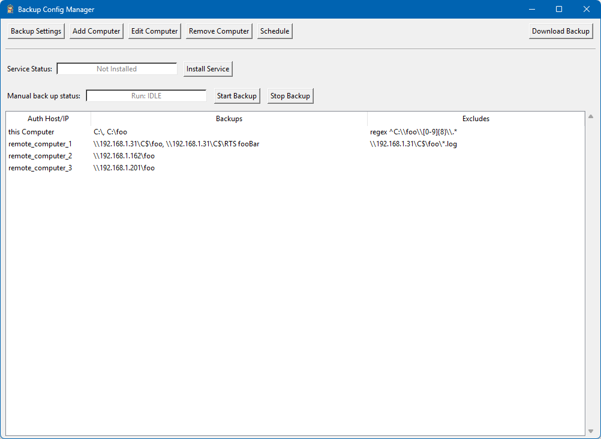
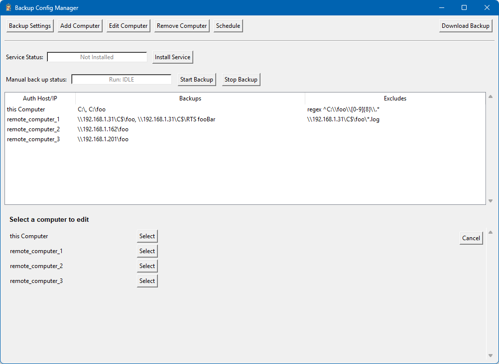
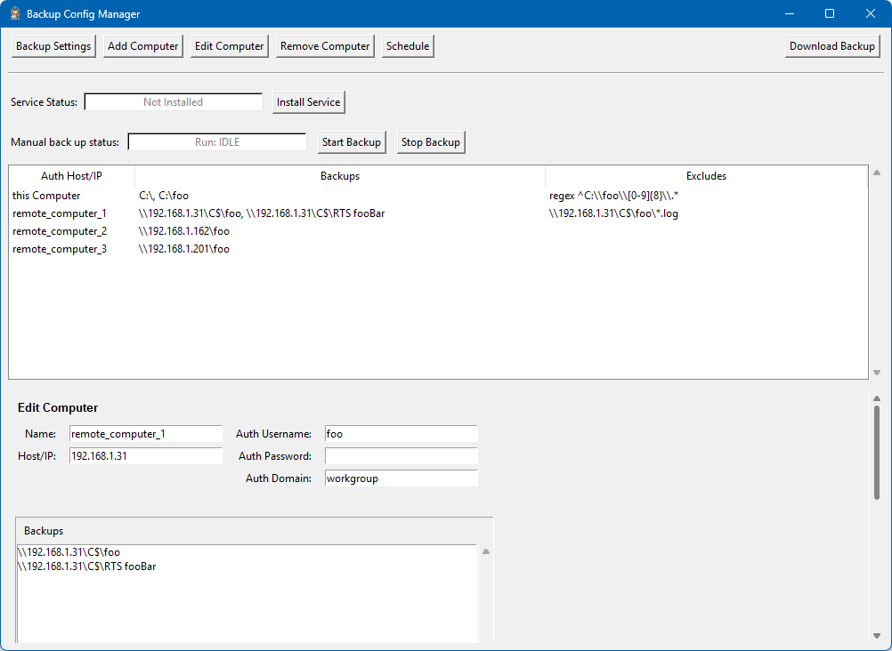
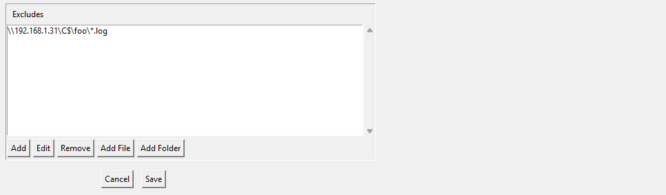
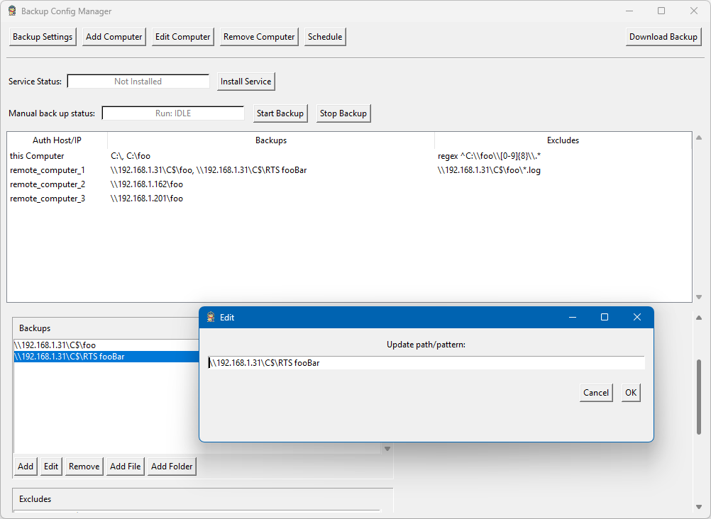
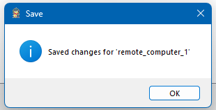

# Backup Tool for Windows SMB

Backup Tool collects files and folders from local paths or remote UNC/SMB shares, creates a ZIP archive for each run, uploads the archive to a central SMB destination, and enforces backup retention. The application can run manually, on a schedule, or as a Windows service.

## Highlights

- Back up local files, local folders, and UNC/SMB paths.
- Configure a separate connection, credentials, paths, and exclusions for each computer.
- Store ZIP archives on a central SMB server.
- Run backups manually, on a schedule, or as a Windows service.
- Protect stored passwords with Windows DPAPI.
- Edit the complete configuration through the Backup Config Manager GUI.
- Download an existing backup through the GUI.

## Contents

- [First-time setup](#first-time-setup)
- [Visual configuration guide](#visual-configuration-guide)
- [Configuration reference](#configuration-reference)
- [Exclusion rules](#exclusion-rules)
- [Running backups](#running-backups)
- [Windows service](#windows-service)
- [Password protection](#password-protection)
- [Logging](#logging)
- [Troubleshooting](#troubleshooting)
- [Developer reference](#developer-reference)

## First-time setup

1. Install Backup Tool.
2. Open **Backup Tool** from the Windows Start menu.
3. Open **Backup Settings** and enter the destination backup server, backup location, retention count, and logging level.
4. Add or edit every computer that must be backed up.
5. Enter each computer's host or IP, username, password, domain, backup paths, and exclusions.
6. Open **Schedule** and configure the required backup schedule.
7. Run a manual backup and verify the resulting ZIP file before relying on scheduled operation.
8. Install or start the Windows service after the configuration has been verified.

> **Important:** Verify the configuration before enabling scheduled backups. A saved configuration can be valid YAML while still containing an incorrect path, host, credential, or destination.

## Visual configuration guide

### 1. Open Backup Config Manager



The main window displays:

- Current Windows service status.
- Manual backup status and controls.
- Configured computers.
- Backup source paths.
- Exclusion rules.
- Buttons for backup settings, computers, schedule, and backup downloads.

### 2. Choose a computer to edit



Select **Edit Computer**, then select the required computer from the list.

### 3. Update the computer connection



Review and update:

- **Name**: Friendly name used by the GUI.
- **Host/IP**: DNS name or IP address used for SMB access.
- **Auth Username**: Account used to access the computer.
- **Auth Password**: Enter a new password only when the stored password must be changed.
- **Auth Domain**: Windows domain or workgroup.
- **Backups**: Files and folders collected from the computer.
- **Excludes**: Paths, wildcard patterns, or regular expressions that must not be copied.

### 4. Manage exclusions and save



Use **Add**, **Edit**, and **Remove** to maintain exclusion rules. Select **Save** when the computer configuration is complete.

### 5. Edit a backup path



Select an existing backup entry, select **Edit**, update the path or pattern, and select **OK**.

### 6. Confirm the saved configuration



The save confirmation indicates that the computer entry was written to the configuration file. Select **OK** to continue.

## Configuration reference

The configuration file is named `backup_config.yaml` and is normally stored beside `backupTool.exe`.

### Current YAML structure

```yaml
backupServerIps:
  - 192.168.1.20
  - backup-server.example.local

backupLocation: backups/tools
retentionCount: 14
logLvl: 3
Version: 5

auth:
  dpapiScope: machine
  default:
    username: backup_user
    domain: workgroup
    password: PlaintextOnlyUntilProtected

schedule:
  daily: "02:00"

computer2Backup:
  - remote_computer_1:
      Connection:
        Host: 192.168.1.31
        Username: foo
        Domain: workgroup
        Password: PlaintextOnlyUntilProtected
        EncryptedPassword: ""
      Backups:
        - "\\\\192.168.1.31\\C$\\foo"
        - "\\\\192.168.1.31\\C$\\RTS fooBar"
      Exclude:
        - "\\\\192.168.1.31\\C$\\foo\\*.log"
```

### Top-level settings

| Setting | Purpose |
| --- | --- |
| `backupServerIps` | SMB destination servers tried by the application. |
| `backupLocation` | Share and optional subfolder used for uploaded ZIP files. Do not include the server name. |
| `retentionCount` | Maximum number of backup ZIP files retained for a computer. |
| `tempRoot` | Optional local staging directory used before upload. |
| `logLvl` | Logging level: `0` error, `1` warning, `2` info, `3` debug, `4` verbose. |
| `Version` | Configuration or application version displayed by the tool. |
| `auth.default` | Optional fallback credentials. |
| `auth.dpapiScope` | DPAPI scope, normally `machine` for service operation or `user` for interactive-only operation. |
| `schedule` | Cron, daily, weekly, monthly, or interval schedule. |
| `computer2Backup` | Computer definitions, connections, backup paths, and exclusions. |

### Computer connection settings

Each computer owns its connection information under `Connection`.

| Setting | Purpose |
| --- | --- |
| `Host` | DNS name or IP address for the computer. |
| `Username` | SMB username for this computer. |
| `Domain` | Windows domain or workgroup. |
| `Password` | Plaintext password accepted temporarily before protection. |
| `EncryptedPassword` | DPAPI-protected password generated by the application. |
| `Backups` | Source files and folders copied from the computer. |
| `Exclude` | Paths and patterns skipped during copy. |

Do not restore the retired `auth.hosts` section. Per-computer credentials belong under each computer's `Connection` section.

### Schedule examples

Use one schedule style at a time.

```yaml
schedule:
  cron: "0 2 * * 1-5"
```

```yaml
schedule:
  daily: "02:00"
```

```yaml
schedule:
  weekly:
    runAt: "02:00"
    days:
      - mon
      - wed
      - fri
```

```yaml
schedule:
  monthly:
    runAt: "03:30"
    days:
      - 1
      - 15
```

```yaml
schedule:
  intervalMinutes: 120
```

## Exclusion rules

Exclusions are evaluated against normalized paths.

### Literal or prefix path

```text
C:\Projects\.git
```

### Wildcard pattern

```text
*\node_modules\*
```

### Regular expression

Prefix the expression with `regex `.

```text
regex ^C:\\foo\\[0-9]{8}\\.*
```

Test regular expressions carefully because an overly broad expression can exclude required files.

## Running backups

### GUI

Open Backup Tool and select **Start Backup** for an on-demand run. The manual backup status field reports the current state.

### Command line

Run one backup and exit:

```bat
backupTool.exe --run
```

Launch the GUI:

```bat
backupTool.exe --GUI
```

Protect passwords in the configuration:

```bat
backupTool.exe --protect
```

Run service mode in the foreground:

```bat
backupTool.exe --service
```

## Windows service

The installer places Backup Tool in the Program Files directory, creates the Backup Tool Windows service, and creates all-users Start menu shortcuts.

The service uses the configuration stored beside the installed executable. Verify the configuration and credentials before starting scheduled service operation.

## Password protection

Backup Tool uses Windows DPAPI to protect passwords.

- A plaintext `Password` or `password` value is accepted only as input for protection.
- Protection writes the encrypted value to `EncryptedPassword` or `encryptedPassword`.
- The plaintext password is cleared after successful protection.
- `machine` scope is intended for service operation on that computer.
- `user` scope restricts decryption to the Windows user that protected the password.

A password protected on one computer may not be usable on another computer. Re-enter and protect credentials after moving the configuration to a different system.

## Logging

Logs are written near the executable and rotated when the configured size threshold is reached. Use `logLvl: 3` for troubleshooting and return to the normal operational level after the issue is resolved.

Never post logs publicly without reviewing them for computer names, IP addresses, paths, usernames, and other environment details.

## Troubleshooting

### SMB connection fails

- Verify the host or IP is reachable.
- Verify TCP port 445 or 139 is available as required by the target.
- Verify username, password, domain, and share permissions.
- Verify that the path uses the correct share name, such as `C$` only when administrative shares are enabled and permitted.
- Review the Backup Tool log for the exact SMB error.

### Password cannot be decrypted

- Verify Backup Tool is running on the computer where the password was protected.
- Verify the selected `dpapiScope` matches how the application runs.
- Clear the encrypted value, enter the password again through the GUI, and save the configuration.

### Backup paths are ignored

- Check the exclusion list for a matching literal path, wildcard, or regular expression.
- Confirm UNC escaping in YAML.
- Confirm that the account can list and read the source path.

### ZIP files do not appear at the destination

- Confirm `backupServerIps`.
- Confirm `backupLocation` contains the share and optional subpath, not the server name.
- Confirm write permission on the destination.
- Review the log for copy, ZIP, upload, or retention failures.

### Service does not run the expected configuration

- Confirm the service is using the installed executable and the configuration beside that executable.
- Save the configuration through the installed GUI.
- Restart the service after correcting service-level or credential issues.

## Developer reference

### Main modules

| File | Purpose |
| --- | --- |
| `backupTool.py` | Application entry point and mode selection. |
| `GUI.py` | Tk/Tkinter configuration interface and service controls. |
| `config_loader.py` | YAML loading, migration, normalization, and hot reload. |
| `backup.py` | Backup orchestration, staging, ZIP creation, upload, and retention. |
| `smb_ops.py` | SMB connections, cached sessions, and remote file operations. |
| `passwords.py` | DPAPI encryption, decryption, and config sanitization. |
| `cron.py` | Cron-like and convenience schedule handling. |
| `scheduler_thread.py` | Scheduled-run coordination. |
| `utils.py` | Path, file, ZIP, cleanup, and normalization utilities. |
| `simpleLogger.py` | Console and file logging. |

### Repository documentation layout

```text
README.md
images/
  01-main-window.png
  02-select-computer.png
  03-edit-computer.png
  04-excludes-and-save.png
  05-edit-backup-path.png
  06-save-confirmation.png
```

`README.md` is the documentation source used by the repository. The installer converts the same Markdown file into `README.html` for the installed Start menu help shortcut.
